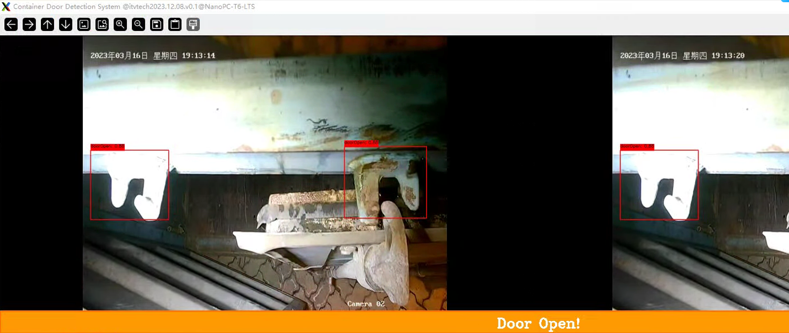

# 预置条件：
- 操作系统： arm64 ubuntu 22.04
- Python: python 3.10
- Paho-mqtt: 2.0+ (or it would cause interface issue)

# 安装配置步骤
## 1.	通过Mobax连接RK3588板子，确保SSH和FTP都能通
## 2.	将压缩包上传到设备上并解压
```
push *.tar to /home/pi/Documents/
tar -xvf YoloV8s_DetectionDoorLock_v20240306.tar
```
## 3.	创建python链接
```
cd /usr/bin/
sudo ln -n python3.10 python
```

## 4.	配置算法程序所需环境
### 4.1.	更新环境
```
sudo apt-get update
sudo apt-get upgrade
```

### 4.2.	安装公开依赖库 
```
sudo apt-get install pip
pip install opencv-python
pip install onnxruntime
pip install paho-mqtt
```
### 4.3.	安装RKNN运行时库
```
cd /home/pi/Documents/DoorLockOpenDetection/YoloV8s_DetectionDoorLock_v20240306
python -m pip install rknn_toolkit_lite2-1.6.0-cp310-cp310-linux_aarch64.whl
sudo cp ./models/librknnrt.so /usr/lib/
```
### 4.4.	配置并运行
确保config.json被正确配置
- a). 默认配置运行于NPU，可以将
run_on_npu 设置为false将其运行于CPU

- b). 默认配置启动MQTT服务,请配置服务器IP地址，否则可暂时停用MQTT服务
enable_MQTT 设置为false 暂时停用MQTT

- c). 配置RTSP地址，必须同时指定两路视频源，可以是本地视频文件或者RTSP：
rtsp_address_a : ./models/test_video.mp4
rtsp_address_b : ./models/test_video.mp4

- d). 运行 
python video_object_detection.py

## 5.	运行截图

